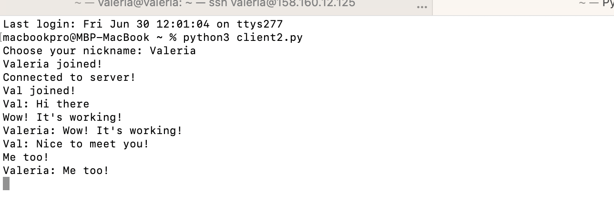
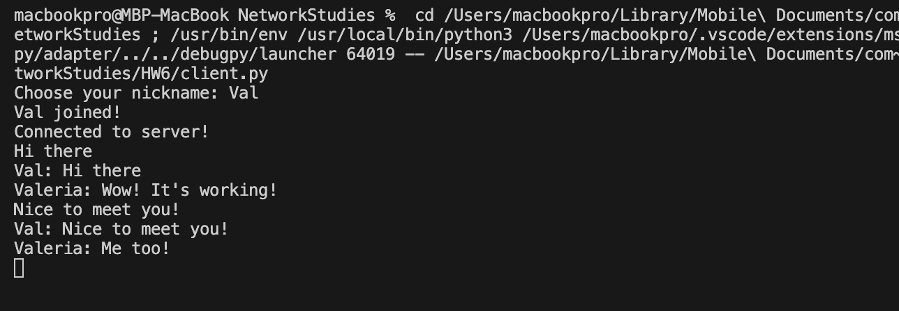
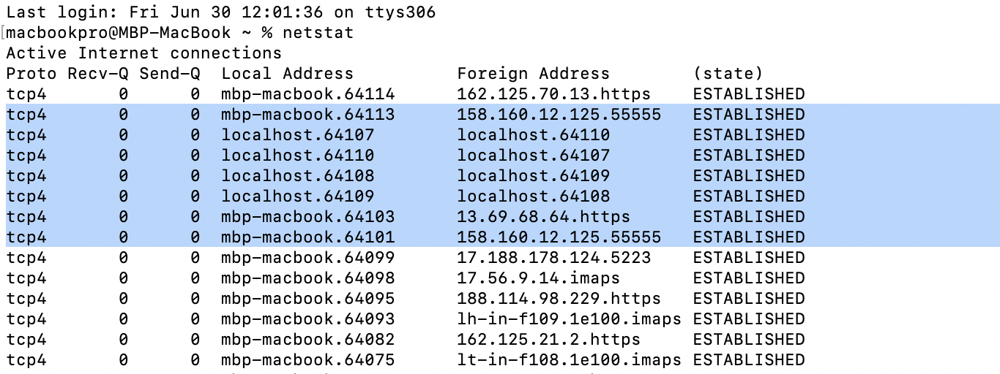

### Task 6:

1. Напишите свою программу сервер и запустите её.
2. Запустите несколько клиентов. Сымитируйте чат.
3. Отправьте мне код написанного сервера (можете через github, если удобно или прямо здесь в txt формате) и  
    скриншоты работающего чата.
4. Отследите сокеты с помощью команды netstat. (тоже пришлите скриншот именно сокетов вашего чата)

### Solution :

Я использовалa Yandex cloud в качестве сервера, один клиент запустилa в терминале MAC,  
а второй в VS Code, [server.py](server.py), [client.py](client.py)  

  
  
  