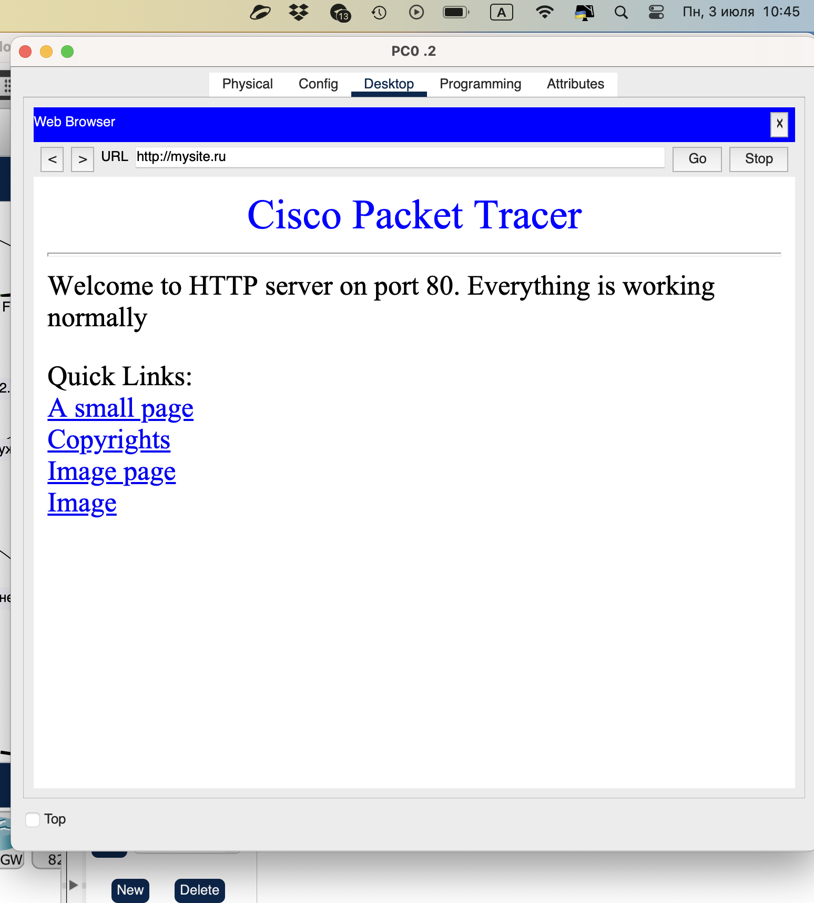
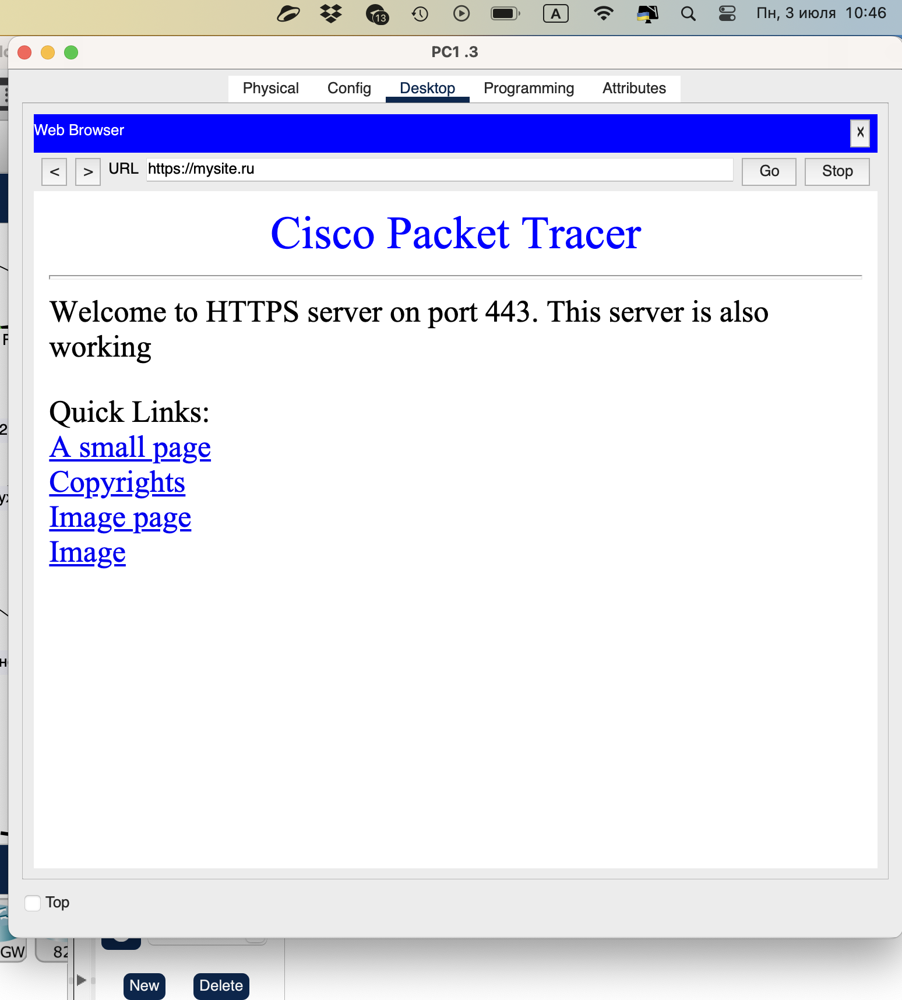
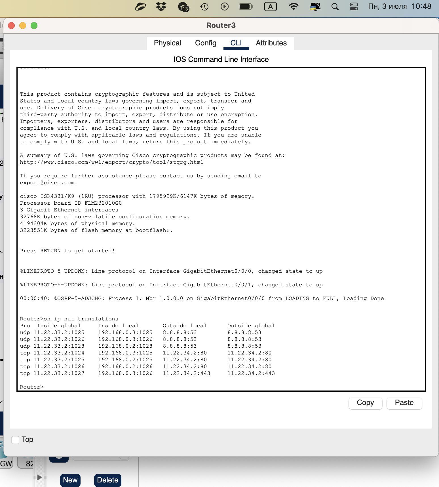
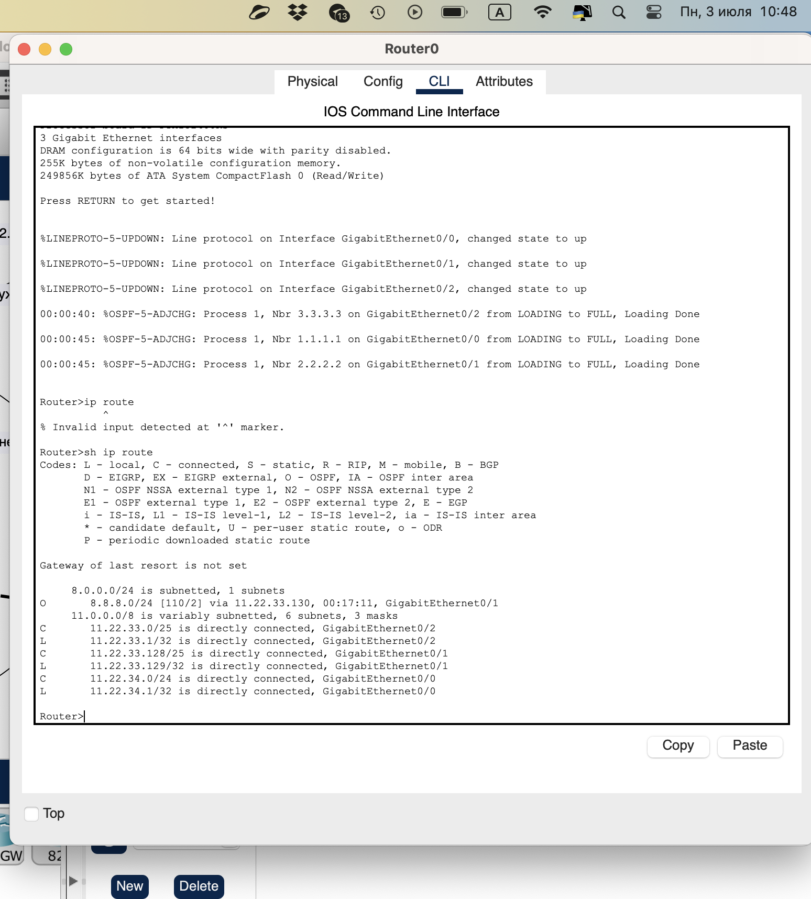
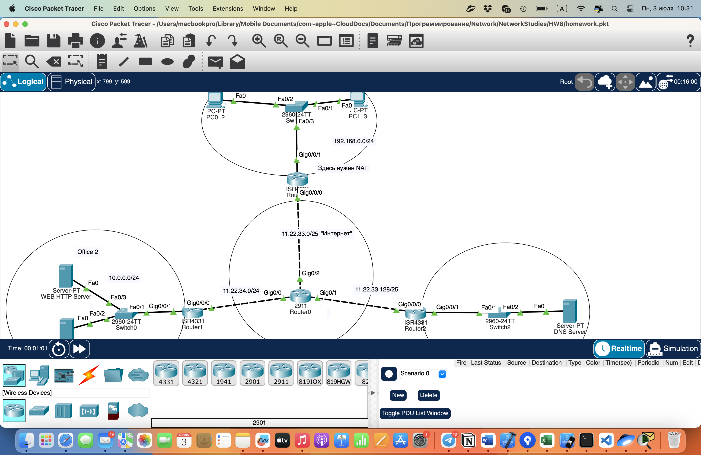

# Task 8:

Настроить сеть согласно информации на схеме (https://disk.yandex.ru/d/Vaxkf2X0RG9NGw)  
Сымитировать "Интернет" с помощью OSPF. Приватных сетей в маршрутизации быть не должно.  
Для компьютеров из Office 1 предоставить доступ в "Интернет" с помощью PAT.  
Открыть доступ из "Интернета" к серверам из Office 2 c помощью Port Forwarding.  
Для компьютеров из Office 1 должны открываться разные сайты по HTTP и HTTPS из Office 2 по одному доменному имени.  
Предоставить скриншоты открытых разных сайтов по одному доменному имени.  
Предоставить скриншот таблицы NAT трансляций с Router3.  
Предоставить скриншот таблицы маршрутизации с Router0.

### Solution:

1. Предоставить скриншоты открытых разных сайтов по одному доменному имени.  
      
      
2. Предоставить скриншот таблицы NAT трансляций с Router3.  
      
3. Предоставить скриншот таблицы маршрутизации с Router0.  
      
Настроенная сеть:  
  
